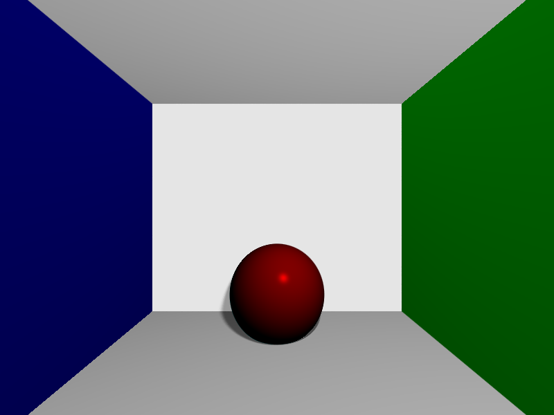
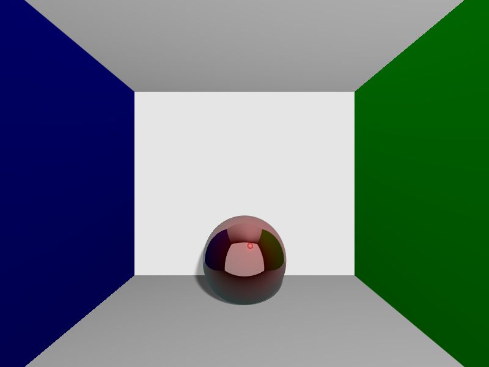

# Raytracer
A very simple C++ based Raytracer, originally written in 2015. 
The code can be compiled using the provided makefile.

The following are some examples for images that can be rendered using this program.

## Optional arguments
|Parameter       |  Default  | Description                                                                                             |
|----------------|-----------|---------------------------------------------------------------------------------------------------------|
|-aaSamples      | 1         | Number of rays to produce per pixel to mitigate aliasing                                                |
|-shadowSamples  | 20        | Number of rays to produce per intersection of another ray with any object, used to produce soft shadows |
|-recDepth       | 3         | Number of allowed recursive rays on reflective and refractive materials                                 |
|-w              | 800       | Width of the image to render                                                                            |
|-h              | 600       | Height of the image to render                                                                           |